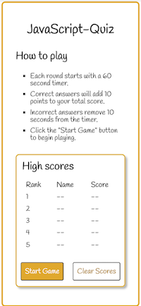
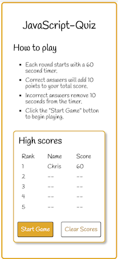

# Code Quiz

## Description

This code quiz application is my first stab at a single-page application using javascript. I created this quiz app from scratch including all content, html and css.

The prompt for this assignment allowed me to apply the following elements from my classroom learnings:

- manipulating and inserting DOM elements using javascript
- setting element attributes
- using timers
- incorporating external fonts
- evaluating conditional logic
- looping over elements in an array
- leverage local storage for persistent data from one session to the next

By the end of this exercise, I feel much more comfortable with each of the elements above. I also took a mobile first approach to designing this application and sed media queries to make it responsie for larger formats.

## Access the application

The deployed application can be accessed [here](https://cleave13.github.io/code-quiz/)

The source code can be found [here](https://github.com/cleave13/code-quiz)

## How to play

When you land on the first page of the application, you are presented with a set of instructions and a a blank leaderboard.

 

When the game starts, the app put 60 seconds on the clock and starts decrementing the timer. Correct answers increment the player's score by 10 points, while incorrect answers remove 10 seconds from the timer.

 

The game is over when the timer runs out or when the player has answered all of the questions. After the game is over, the player has the opportunity to enter their name and submit to the high scores.

 

The top five scores are kept and stored in local storage. This makes the leaderboard persistent even when the player leaves the page and comes back.

 

## Credits

My primary reference materials came from resources from the Univserity of Denver's coding bootcamp.

I used font awesome for the medal icon (participation award) and used google fonts to source the Handlee font.